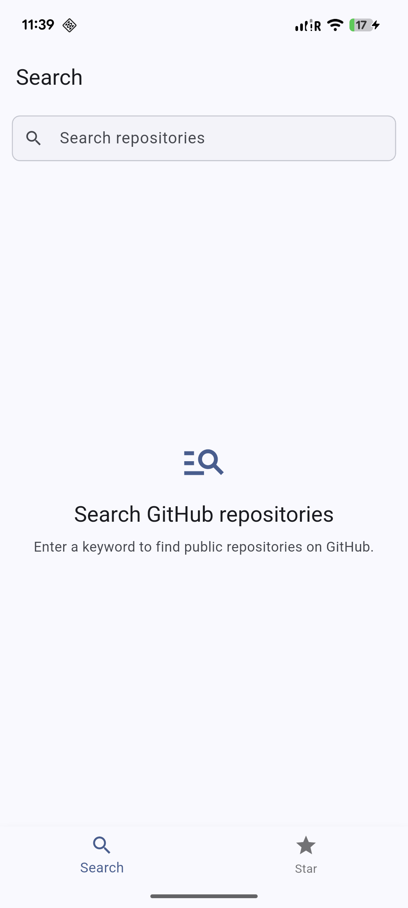
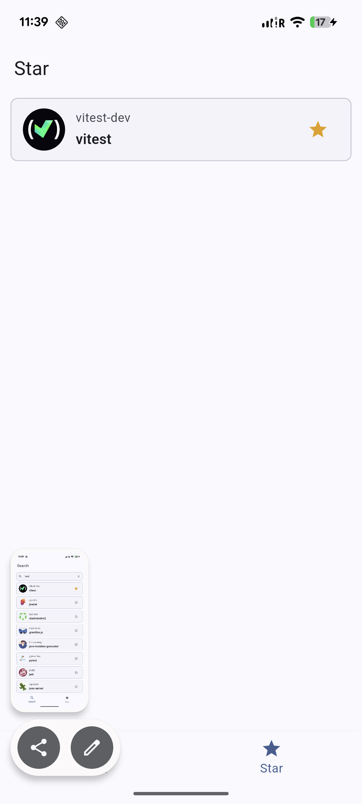
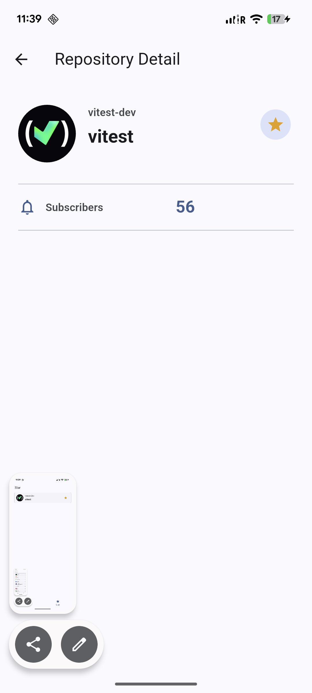
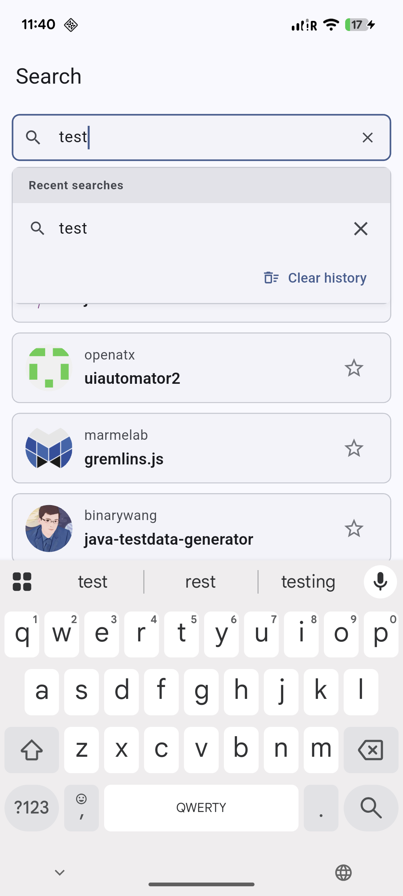
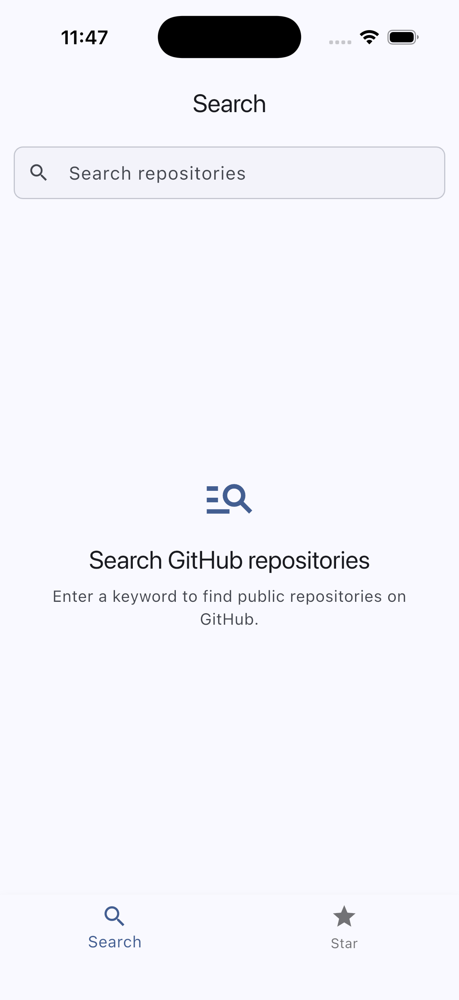
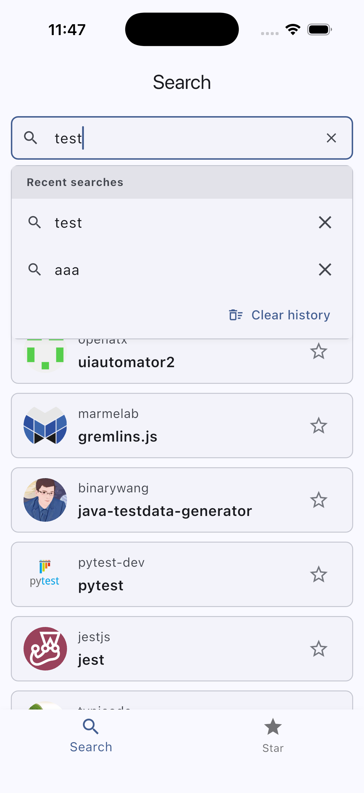
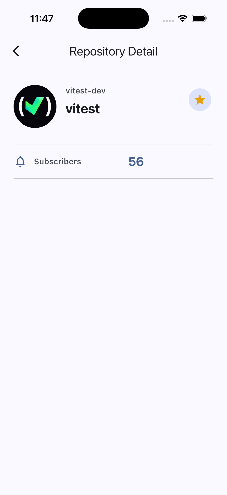
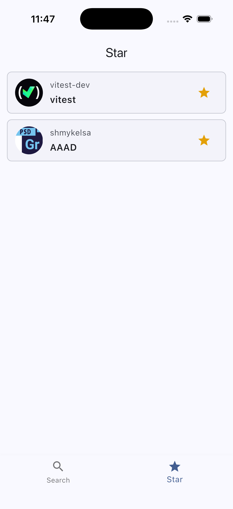

# github_repository_list_app

<p align="center">
  <a href="#english"><strong>English</strong></a>
  &nbsp;|&nbsp;
  <a href="#japanese"><strong>日本語</strong></a>
</p>

## Screenshots

### Android

<p>
  
  
  
  
</p>

### iOS

<p>
  
  
  
  
</p>

<a id="english"></a>

## English

Flutter application for searching public GitHub repositories, viewing repository
details, and managing local favorites.

### Requirements

- Flutter 3.41.x or higher
- Android and iOS support
- No GitHub Authorization header

### Packages

- `http` `^1.6.0`: GitHub REST API requests
- `shared_preferences` `^2.5.5`: local favorites and search history persistence
- `flutter_riverpod` `^3.3.1`: state management and dependency injection

No additional third-party packages are used.

### How To Run

```sh
flutter pub get
flutter run
flutter test
```

### Features

- Bottom navigation with Search and Star tabs
- Repository search by submitted keyword
- Search home, loading, empty, and error states
- Search history stored in `shared_preferences`
- Infinite scroll using GitHub Search API pagination
- Pull-to-refresh for search results
- Repository detail screen
- Local favorite add/remove without GitHub Star API
- Favorite state synchronization across Search, Detail, and Star screens
- Favorites persist across app restart
- Portrait-only screen orientation

### GitHub REST API

Repository Search API:

```text
GET https://api.github.com/search/repositories?q={query}&page={page}&per_page=30
```

Repository Detail API:

```text
GET https://api.github.com/repos/{owner}/{repo}
```

The app handles non-2xx responses, timeouts, network errors, JSON decode errors,
and unexpected response shapes.

### Project Structure

```text
lib/
  main.dart
  app.dart
  navigation/
  config/
  models/
  network/
  data/
  repositories/
  providers/
  features/
    search/
    favorites/
    detail/
  widgets/
  utils/
```

Main responsibilities:

- `config`: app and GitHub API constants
- `navigation`: app-level navigation shell
- `models`: shared immutable models
- `network`: low-level HTTP/JSON request utility
- `data`: GitHub API client and local storage classes
- `repositories`: repository interfaces and implementations
- `providers`: Riverpod dependency providers
- `features/search`: search UI, state, controllers, and search history
- `features/favorites`: favorite list UI, state, and controller
- `features/detail`: detail UI, state, and controller
- `widgets`: shared UI components
- `utils`: shared helpers

### Key Implementation Points

- Search requests are triggered by the keyboard search action or by selecting a search history item, not on every text change.
- Search history keeps the latest configured number of records.
- Search pagination requests one page at a time and prevents duplicate next-page requests.
- Favorites are stored locally with only:
  - `id`
  - `full_name`
  - `owner.avatar_url`
- `favoriteProvider` is the single source of truth for favorite state.
- `detailProvider` is `autoDispose` because detail screens are pushed pages.

### `full_name` Display

The task requires displaying `full_name`.

GitHub repository `full_name` has this format:

```text
owner/repository
```

The app keeps `full_name` as the source value and splits it by `/` only for UI
display:

```text
owner
repository
```

This is used in repository list items and the detail screen.

Reason:

- It satisfies the task requirement to use `full_name`.
- It avoids adding unnecessary display fields.
- It reduces the chance of long `owner/repository` text overflowing the screen.
- It improves readability and visual hierarchy.

### Tests

The project includes unit and widget tests for:

- favorite add/remove logic
- low-level API client success and error handling
- search history limit
- search pagination and stale-response handling
- repository tile display and tap behavior
- search home state
- search history focus behavior
- search error retry
- detail error retry

<a id="japanese"></a>

## 日本語

公開 GitHub リポジトリの検索、リポジトリ詳細の表示、ローカルのお気に入り管理を行う Flutter アプリです。

### 要件

- Flutter 3.41.x 以上
- Android / iOS 対応
- GitHub Authorization ヘッダーなし

### 使用パッケージ

- `http` `^1.6.0`: GitHub REST API リクエスト
- `shared_preferences` `^2.5.5`: お気に入りと検索履歴のローカル永続化
- `flutter_riverpod` `^3.3.1`: 状態管理と依存性注入

追加のサードパーティパッケージは使用していません。

### 実行方法

```sh
flutter pub get
flutter run
flutter test
```

### 機能

- Search / Star タブを持つ BottomNavigation
- 確定したキーワードによるリポジトリ検索
- Search の Home、Loading、Empty、Error 状態
- `shared_preferences` による検索履歴保存
- GitHub Search API のページングを使った無限スクロール
- 検索結果の Pull-to-refresh
- リポジトリ詳細画面
- GitHub Star API を使わないローカルお気に入り追加/削除
- Search、Detail、Star 画面間のお気に入り状態同期
- アプリ再起動後もお気に入りを保持
- 縦画面固定

### GitHub REST API

Repository Search API:

```text
GET https://api.github.com/search/repositories?q={query}&page={page}&per_page=30
```

Repository Detail API:

```text
GET https://api.github.com/repos/{owner}/{repo}
```

非 2xx レスポンス、タイムアウト、ネットワークエラー、JSON デコードエラー、想定外のレスポンス形式を処理します。

### プロジェクト構成

```text
lib/
  main.dart
  app.dart
  navigation/
  config/
  models/
  network/
  data/
  repositories/
  providers/
  features/
    search/
    favorites/
    detail/
  widgets/
  utils/
```

主な役割:

- `config`: アプリと GitHub API の定数
- `navigation`: アプリ全体のナビゲーション shell
- `models`: 共通の immutable モデル
- `network`: 低レベルの HTTP/JSON リクエスト処理
- `data`: GitHub API クライアントとローカルストレージクラス
- `repositories`: Repository インターフェースと実装
- `providers`: Riverpod の依存関係 Provider
- `features/search`: 検索 UI、状態、Controller、検索履歴
- `features/favorites`: お気に入り一覧 UI、状態、Controller
- `features/detail`: 詳細 UI、状態、Controller
- `widgets`: 共通 UI コンポーネント
- `utils`: 共通ヘルパー

### 実装ポイント

- 検索リクエストはキーボードの検索アクション、または検索履歴の選択で実行します。入力中に毎回 API は呼びません。
- 検索履歴は設定値で定義された最新件数のみ保持します。
- 検索ページングは 1 ページずつ取得し、重複した次ページリクエストを防ぎます。
- お気に入りとしてローカル保存する値は以下のみです。
  - `id`
  - `full_name`
  - `owner.avatar_url`
- `favoriteProvider` をお気に入り状態の single source of truth としています。
- 詳細画面は push される画面のため、`detailProvider` は `autoDispose` にしています。

### `full_name` の表示

課題要件として `full_name` の表示が指定されています。

GitHub リポジトリの `full_name` は以下の形式です。

```text
owner/repository
```

アプリでは `full_name` を元データとして保持し、UI 表示時のみ `/` で分割しています。

```text
owner
repository
```

この表示はリポジトリ一覧 item と詳細画面で使用しています。

理由:

- `full_name` を使用するという課題要件を満たすため
- 表示用の不要なフィールドを追加しないため
- 長い `owner/repository` が画面外にはみ出す可能性を下げるため
- UI の読みやすさと視覚的な階層を改善するため

### テスト

以下の unit test / widget test を含めています。

- お気に入りの追加/削除
- 低レベル API client の成功/エラー処理
- 検索履歴の件数制限
- 検索ページングと古いレスポンスの無視
- リポジトリ item の表示とタップ挙動
- Search の Home 状態
- 検索履歴の focus 表示
- 検索 Error の Retry
- 詳細 Error の Retry
